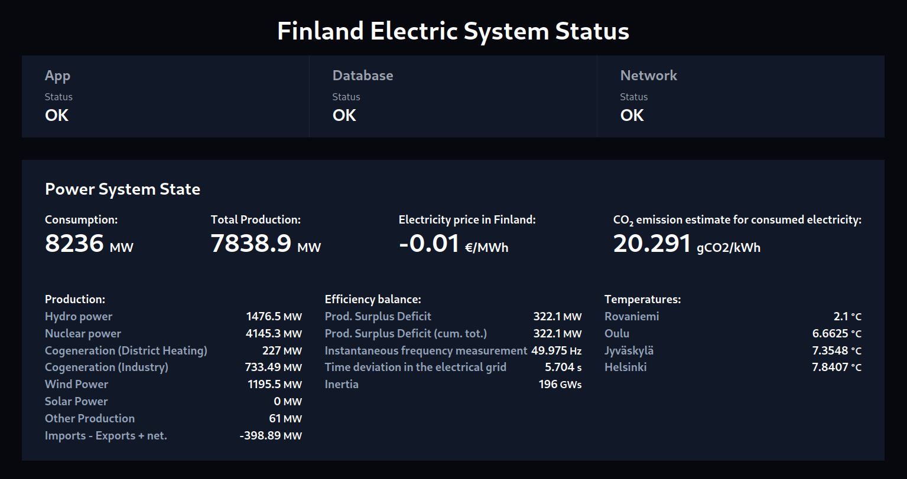

# Finland Power Status

This is a basic Vite React TypeScript client SPA (Single Page Application) that can display data about the finnish power grid.

This serves as an example of how to generate an API in TypeScript from an OpenAPI specification and also using the generated API.

A Node.js proxy is used to adhere to the CORS policy at the end server.

**You need an API key to be able to use this client.**

## How to install and run
```bash
npm install

npm run dev

# To proxy the requests to our dev server and then to the live server (CORS)
cd proxy-dev-server
node proxy.js
```

The API in TypeScript **was** generated with the following command (no need to run this again):
```bash
# openapi-generator-cli generate -i avoindata-api.json -g typescript-fetch -o ./generated-api
npm run generate-api
```

### Screenshot


### The data is from Fingrid
https://developer-data.fingrid.fi/